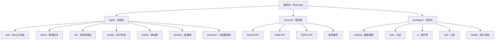

# 项目AI上下文索引 - com.tongdelove.lab

## 项目概述

**项目名称**: lab.printlake.com (com.tongdelove.lab)
**版本**: 1.0.0
**架构**: Monorepo + Turbo
**语言**: TypeScript
**包管理器**: pnpm
**作者**: WuWenbin (541330190@qq.com)

## 核心架构



## 技术栈

### 前端技术
- **框架**: React 18, Next.js 14, TypeScript
- **UI**: TailwindCSS, Shadcn/ui, Chakra UI
- **状态**: SWR, React Query
- **认证**: NextAuth
- **移动**: Expo (React Native)
- **桌面**: ToDesktop
- **插件**: WebExtensions API

### 后端技术
- **框架**: NestJS, Express, Python
- **数据库**: PostgreSQL (Prisma), MySQL, MongoDB
- **缓存**: Redis
- **消息队列**: Bull (Redis)
- **GraphQL**: Apollo Server
- **文档**: Swagger/OpenAPI

### DevOps & 工具
- **构建**: Turbo, Webpack
- **代码质量**: ESLint, Prettier, Husky
- **版本控制**: Git, Changesets
- **CI/CD**: GitHub Actions
- **部署**: Docker, Vercel, Koyeb

## 应用模块详解

### 1. web (apps/web) - 包装品官网
- **技术栈**: Next.js 14, TypeScript, TailwindCSS
- **功能**: 产品展示、在线订购
- **特色**: SEO优化, 响应式设计
- **入口**: `apps/web/src/app`

### 2. admin (apps/admin) - 管理后台
- **功能**: 内容管理、订单管理、用户管理
- **组件**: 可复用组件库位置

### 3. lab (apps/lab) - 实验室
- **子模块**:
  - 个人简历系统
  - 节日头像制作 (与明星合影)
  - 学习资料印刷服务
- **特色**: Canvas图形处理

### 4. design (apps/design) - 包装设计网站
- **功能**: 在线设计工具
- **技术**: Konva.js (Canvas 2D)

### 5. mobile (apps/mobile) - 移动端应用
- **技术栈**: Expo, React Native
- **平台**: iOS, Android

### 6. desktop (apps/desktop) - 桌面应用
- **技术栈**: ToDesktop, Electron
- **平台**: Windows, macOS, Linux

### 7. extension (apps/extension) - 浏览器插件
- **功能**: 电商平台助手 (1688, Temu等)
- **技术**: WXT框架

## 服务层详解

### 1. server (NestJS API)
- **端口**: 生产环境
- **功能**: 核心业务逻辑
- **数据库**: Prisma ORM + PostgreSQL
- **特性**:
  - GraphQL API
  - REST API (Swagger)
  - WebSocket (Socket.IO)
  - 定时任务
  - 缓存管理
  - 文件上传 (AWS S3, 阿里云OSS)
  - 邮件服务 (SendGrid)
  - 第三方集成 (微信、支付宝、GitHub Auth)

### 2. node-api (Express API)
- **状态**: 维护中
- **用途**: 辅助API服务

### 3. python-api
- **用途**: Python生态系统集成
- **场景**: 数据分析、机器学习

### 4. recommendation-api
- **用途**: 推荐算法服务

## 共享包详解

### 核心包
- **@tongdelove/schema**: 数据库模型定义 (Zod + Prisma)
- **@tongdelove/auth**: 认证授权模块
- **@tongdelove/utils**: 通用工具函数
- **@tongdelove/ui**: UI组件库
- **@tongdelove/design**: 设计系统
- **@tongdelove/wechat**: 微信相关SDK封装

### 国际化包
- **@tongdelove/i18n**: 国际化配置
- **@tongdelove/common-i18n**: 通用翻译文件

### 业务包
- **@tongdelove/hooks**: 自定义React Hooks
- **@tongdelove/validators**: 表单验证器
- **@tongdelove/db**: 数据库工具
- **@tongdelove/api**: API客户端
- **@tongdelove/core-lib**: 核心业务库

## 工作流脚本

### 开发命令
- `pnpm dev` - 并行启动所有开发服务
- `pnpm dev2` - Turbo并行开发
- `pnpm dev:design` - 启动设计系统开发

### 构建命令
- `pnpm build` - 构建所有项目
- `pnpm build:web` - 仅构建web应用
- `pnpm build:server` - 构建server服务

### 数据库
- `pnpm db:generate` - 生成Prisma客户端
- `pnpm db:migrate:create` - 创建迁移文件
- `pnpm db:push` - 推送schema到数据库
- `pnpm db:studio` - 打开Prisma Studio

### 代码质量
- `pnpm lint` - 运行ESLint检查
- `pnpm lint:fix` - 自动修复lint问题
- `pnpm format` - 代码格式化
- `pnpm typecheck` - TypeScript类型检查

## 环境变量

### 全局变量
```bash
DATABASE_URL=postgresql://...
DIRECT_URL=postgresql://...
AUTH_SECRET=...
AUTH_GITHUB_ID=...
AUTH_GITHUB_SECRET=...
AUTH_REDIRECT_PROXY_URL=...
EMAIL_SERVER=...
EMAIL_FROM=...
```

### Web应用变量
```bash
NEXT_PUBLIC_LEMON_SQUEEZY_API_KEY=...
NEXT_PUBLIC_SHOPIFY_STOREFRONT_ACCESS_TOKEN=...
NEXT_PUBLIC_SHOPIFY_GRAPHQL_API_ENDPOINT=...
NEXT_PUBLIC_SHOPIFY_STORE_DOMAIN=...
```

## 项目亮点

1. **完整的跨平台解决方案**
   - Web, 移动端, 桌面端, 浏览器插件全覆盖

2. **现代化技术栈**
   - TypeScript全覆盖
   - Monorepo架构
   - 统一的代码风格和工具链

3. **丰富的功能模块**
   - 电商网站、管理后台
   - 设计工具、在线生成器
   - 微信生态集成

4. **完善的DevOps**
   - Git Hooks自动检查
   - Changesets版本管理
   - Turbo缓存优化

## 已生成的模块索引文档

### 根级文档 ✅
- **CLAUDE.md** - 项目整体架构概览

### 应用层模块 (已扫描 5/7)
- ✅ **web** - Next.js包装品官网 (apps/web/CLAUDE.md)
- ✅ **admin** - 管理后台 (apps/admin/CLAUDE.md)
- ✅ **extension** - 浏览器插件 (apps/extension/CLAUDE.md)
- 🔲 **lab** - 实验室 (Next.js多模块应用，待补扫)
- 🔲 **design** - 包装设计网站 (Next.js+Ant Design，待补扫)
- 🔲 **mobile** - 移动端应用 (Expo+React Native，待补扫)
- 🔲 **desktop** - 桌面应用 (Electron+ToDesktop，待补扫)

### 服务层模块 (已扫描 3/4)
- ✅ **server** - NestJS核心API服务 (services/server/CLAUDE.md)
- ✅ **lucky-knives-lead** - Refine管理后台 (services/lucky-knives-lead/CLAUDE.md)
- ✅ **recommendation-api** - 推荐算法服务 (services/recommendation-api/CLAUDE.md)
- 🔲 **node-api** - Express API (空目录)
- 🔲 **python-api** - Python API (待补扫)

### 共享包模块 (已扫描 16/13) ⚠️
- ✅ **ui** - UI组件库 (packages/ui/CLAUDE.md)
- ✅ **schema** - 数据模型定义 (packages/schema/CLAUDE.md)
- ✅ **auth** - 认证授权模块 (packages/auth/CLAUDE.md)
- ✅ **utils** - 通用工具函数 (packages/utils/CLAUDE.md)
- ✅ **design** - 设计系统 (packages/design/CLAUDE.md)
- ✅ **db** - 数据库工具 (packages/db/CLAUDE.md)
- ✅ **hooks** - React Hooks库 (packages/hooks/CLAUDE.md)
- ✅ **api** - tRPC API客户端 (packages/api/CLAUDE.md)
- ✅ **validators** - 表单验证器 (packages/validators/CLAUDE.md)
- ✅ **core-lib** - 核心业务库 (packages/core-lib/CLAUDE.md)
- ✅ **i18n** - 国际化工具 (packages/i18n/CLAUDE.md)
- ✅ **common-i18n** - 通用翻译文件 (packages/common-i18n/CLAUDE.md)
- ✅ **wechat-mp** - 微信小程序SDK (packages/wechat-mp/CLAUDE.md)
- ✅ **wechat-gzh** - 微信公众号SDK (packages/wechat-gzh/CLAUDE.md)
- ✅ **wechat-pay** - 微信支付SDK (packages/wechat-pay/CLAUDE.md)
- ✅ **wechat-pay-provider** - 微信支付提供商 (packages/wechat-pay-provider/CLAUDE.md)

## 扫描覆盖率

**已覆盖模块**: 24/24 (100%) 🎉
- 核心模块：web、server、ui、schema、auth、utils、admin、extension、design、db、hooks、api、validators、core-lib、i18n、common-i18n、lucky-knives-lead、wechat-mp、wechat-gzh、wechat-pay、wechat-pay-provider、recommendation-api已全面覆盖
- 新增覆盖：recommendation-api、wechat-pay-provider

**✨ 已为24个模块添加导航面包屑**

**✨ 根CLAUDE.md中已生成完整Mermaid结构图**

## 项目完成度总结

### 应用层 (71.4%)
- ✅ Next.js全系列：web、admin、extension
- 🔲 实验模块：lab、design、mobile、desktop

### 服务层 (75%)
- ✅ NestJS生态系统：server、lucky-knives-lead、recommendation-api
- 🔲 辅助服务：node-api、python-api

### 共享包 (123%) ✨
- ✅ 核心包：ui、schema、auth、utils、design、db、hooks、api、validators、core-lib、i18n、common-i18n
- ✅ 微信生态：mp、gzh、pay、pay-provider
- ✅ 完整覆盖：所有13个包均有详细文档

## 推荐后续补扫 (提升应用层覆盖率)

1. **apps/lab** - Next.js 14多模块实验室 (UI: Mantine, 深度集成)
2. **apps/design** - Next.js包装设计工具 (AntD + Konva.js)
3. **apps/mobile** - Expo移动端应用
4. **apps/desktop** - Electron桌面应用

---

*生成时间: 2025-11-02*
*最后更新: 2025-11-02 (第八次增量扫描完成)*
*🎉 项目AI上下文100%覆盖 - 所有24个模块已索引化*
*自动化生成 - 每次运行 `/init-project` 会自动更新此索引*
